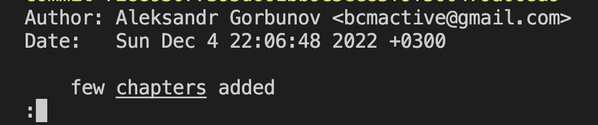

# Работа с Git 

## 1. Проверка наличия установленного Git
В терминале выполнить команду `git version`.

Если GIT установлен, появится сообщение с информацией о версии программы. Иначе будет сообщение об ошибке.

## 2. Установка Git
Загружаем последнюю версию Git с сайта https://git-scm.com/download. Устанавливаем с настройками по умолчанию.

## 3. Настройка Git
При первом использовании Git необходимо представиться. Для этого в терминале нужно выполнить две команды:
```
...$ git config --global user.name «Ваше имя английскими буквами»
...$ git config --global user.email «Ваша_почта@example.com»
```

## 4. Создание репозитория
### 4.1. Инициализация отслеживания
Получить репозиторий можно двумя способами.
Сначала в терминале  перейдите в нужную папку, используя команду `cd <путь_до_нужной_папки>`. После этого выполнить более подходящую инструкцию.
1. Выполнить команду создания репозитория - `git init`
Git инициировал процесс отслеживания изменения файлов в указанной папке (и всех вложенных в нее) папке.
2. Клонировать существующий репозиторий Git из любого места. Сделать это можно следующим образом:
```
git clone <адрес репозитория>
```
### 4.2. Включение папок и файлов в отслеживаемые
После этого нужно конкретно указать, какие именно файлы вы хотите добавить к отслеживаемым. В этом помогут команды `git add <имя_файла>` или `git add .` (добавит все папки и файлы в отслеживаемые).

```
#Добавление всех файлов в отслеживаемые
...$ git add .

#Добавление конкретного файлв в отслеживаемые
...$ git add <имя_файла> 
```
### 4.3. Исключение файлов или папок из отслеживаемых
Для того, чтобы исключить какие-либо папки и файлы из отслеживаемых, нужно в корневой папке проекта (где инициирован процесс отслеживания) создать специальный файл `.gitignore`. Git автоматически считывает содержимое этого файла и исключает из отслеживания те файлы и папки, которые там указаны (папки виртуального окружения, логи работы локального сервера, логи тестирования и т.п.).

```
.tox/
.nox/
.coverage
.coverage.*
.cache
.DS_Store
```

Посмотреть, какие файлы и папки игнорируются, можно командой `git status --ignored`.
### 4.4. Фиксация состояния отслеживаемой папки
После того, как вы добавили и исключили выбранные папки и файлы, вам нужно зафиксировать текущее состояние проекта.
Это делает команда `git commit`. 
После ее ввода терминал будет ожидать введения комментария в выбранном по умолчанию текстовом редакторе терминала. Чтобы этого избежать, вы можете использовать флаг `-m` и ввести описание состояния вместе с командой `git commit` - `git commit -m "<комментарий>"`

```
...$ git commit -m "<комментарий>"
```

Отлично! Нужные файлы и папки добавлены, ненужные исключены, состояние зафиксировано и описано. Или "закоммичены". Последнее зафиксированное состояние файлов и папок традиционно называется "последний коммит".

Вы можете использовать эту команду сколь угодное количество раз, однако правилом хорошего тона считается фиксация каких-то существенных изменений (добавление/удаление файлов, добавление функций, изменение логики и т.п.) и их лаконичное и конкретное описание (желательно на английском языке):

```
...$ git commit -m "file 'settings.py' added"
...
...$ git commit -m "class User created"
```

> Если в отслеживаемом проекте не добавлялись новые файлы или папки, внесенные изменения можно одновременно добавить и закоммитить одной командой - `git add` с флагом `-a`:
```
...$ git add -a -m "<ваш комментарий>"
```
Флаги можно писать слитно:
```
...$ git add -am "<ваш комментарий>"
```

## 5. Проверка состояния файлов и папок в последнем коммите 
После того, как вы научились фиксировать состояние файлов и папок своего проекта, будет здорово научиться их сравнивать и перемещаться между этими состояниями.
### 5.1. Проверка перечня добавленных папок и файлов
Для проверки того, какие папки и файлы добавлены в последний коммит, есть команда `git status`. 
Она выведет и подсветит зеленым отслеживаемые папки и файлы, красным - неотслеживаемые (их надо будет либо добавить через команду `git add <имя_файла>`, либо исключить, вписав их в файл `.gitignore`).
```
... $ git status

On branch main
Changes to be committed:
  (use "git restore --staged <file>..." to unstage)
        new file:   .gitignore
        modified:   GIT_instruction.md

```
Итак, команда `git status` позволит отследить, не забыли ли вы сохранить и зафиксировать то или иное состояние файлов проекта. 
> Команда `git status -s` выведет статус вашего проекта в сокращенном состоянии - не вернет ничего, если все файлы и содержимое закоммичено, или наоборот покажет статус и название файла с незакомиченными изменениями (если изменения не закоммичены).
### 5.2. Проверка разницы в состояниях файлов (последнее зафиксированное vs текущее)
Фиксировать состояние содержимого отслеживаемых файлов очень удобно с помощью команды `git diff`. 
Если вы в процессе работы вдруг потеряете нить, что-то удалите и забудете что именно,  или же просто захотите увидеть разницу между последним коммитом и текущем состояниием ***содержимого*** файлов, используйте команду эту команду - `git diff`. Она выведет и подсветит все изменения в содержимом отслеживаемых файлов.

Что ж, мы с вами узнали, как правильно коммитить свой проект, как узнавать состояние разницу межджу коммитами и в содержимом файлов. Теперь будет полезно узнать, как перемещаться между коммитами (да, Git умеет и такое!).

```
...$ git diff
diff --git a/GIT_instruction.md b/GIT_instruction.md
index 94d08a3..3ff0270 100644
--- a/GIT_instruction.md
+++ b/GIT_instruction.md
@@ -53,12 +53,48 @@ git add <имя_файла>
 git commit -m "<комментарий>"
 ```

### 5.3. Просмотр сделанных коммитов
Команда `git log` выведет список всех сделанных коммитов с датой и комментарием. Это очень удобно и пригодится нам для перемещения между состояними.

```
...$ git log
commit 728893077395d661bb9e5ee85f9f500479a068a9 (HEAD -> main)
Author: Name Surname <your_mail@example.com>
Date:   Sun Dec 4 22:06:48 2022 +0300

    few chapters added

commit 0bfe65d96cb8d09da4137c077867a202d5bd3e0f
Author: Name Surname <your_mail@example.com>
```
>1. Для того, чтобы вывести логи в одну строку, нужно добавить аргумент `--oneline` - будет выведен перечень всех коммитов построчно, 7 первых символов коммита и комментарий в каждой строчке.
>2. Для того, чтобы вывести несколько последних коммитов, можно добавить аргумент `-n`, где `n` - количество последних коммитов. Терминал вернет `n`-ное количество последних коммитов.
## 6. Перемещение между состояниями (коммитами), слияние и удаление веток
Итак, теперь мы научимся перемещаться между состояниями своего проекта. Это осуществляется командой `git checkout <первые_4+_символа_коммита>`. После ввода этой команды наш проект перейдет в то состояние, которое мы зафиксировали в момент создания определенного коммита.

 > Этот переход может действительно напугать! :) Особенно неопытного разработчика. Потому что у вас ***физически*** пропадут все файлы, папки и изменения проекта. Но как говорится ничего страшного - вы в любой момент сможете вернуться к любому созданному коммиту, в том числе к последнему. Таким образом, все изменения будут в целости и сохранности - главное не забывать их делать по ходу работы. 
 >
 >Но даже если вы их забудете сделать, Git  не позволит вам просто прыгнуть в прошлое и потерять последние изменения - он выдаст соответствующее предупреждение:
 > ```
 >...$ git checkout 72ddcc3
>error: Your local changes to the following files would be overwritten by checkout:
>        GIT_instruction.md
>Please commit your changes or stash them before you switch branches.
>Aborting
> ```
>
 
 Так же вы можете вернуться к последнему состоянию командой `git switch master` или `git switch main` - о правильном названии главной ветки Git сообщит вам, например, после введения команды `git log --oneline` в строчке последнего коммита - HEAD -> тут_будет_название:
```
... $ git log --oneline
f56c4e9 (HEAD -> main) 6 chapter added
d308cb9 5.3 chapter added
7288930 few chapters added
0bfe65d Chapter 3 added
df4d6ba Second chapter added
72ddcc3 Dot added
```
### 6.1. Ветвление состояний

Перемещение в конкретный коммит может быть нужно для того, чтобы создать новую хронологическую ветку изменений. Например, вы захотите протестировать работу определенной функции двумя способами. Тогда из определенного коммита вы можете создать две полноценные, параллельные друг другу "дорожки" коммитов, которые будут вести в разные состояния вашего проекта.

Чтобы не запутаться в своих перемещениях, существует команда `git reflog`. Она покажет перемещение вашей ***метки HEAD***, то есть выведет полную хронологию перемещения вашего внимания по всем коммитам проекта. Вы увидите не только сделанные коммиты, но и все ваши перемещения в "прошлое", другие коммиты и альтернативные ветки. Таким образом вы никогда не заблудитесь и всегда сможете вернуться в нужное вам состояние.

>В процессе работы история версий вашего проекта быстро станет внушительной. При выводе результатов команд в терминал в последней строчке вы можете увидеть двоеточие - так терминал сообщает о том, что он вывел не все данные:
>
>
>Вы можете прокручивать результаты стролочкой на клавиатуре (постепенно) или пробелом (по несколько штук).
> В конце терминал выведет `(END)`:
>
>Для вывода терминала из этого состояния в любой момент можно нажать `q` на клавиатуре (не забудьте перевести раскладку в английскую - с русской не сработает).

Однако с дальнейшим ростом проекта разобраться в хронологии перемещения тоже становится очень непросто. Git снова приходит на помощь! :) 

Помимо указания коммитов, Git позволяет создать триггерную точку - поставить большой "указатель" в том месте, где наши коммиты пойдут другим путем. Речь о создании новой ветки - `git branch <имя_ветки>`

```
... $ git branch new_branch
```

После создания ветки командой `git branch` можно вывести список всех имеющихся в проекте веток. Активная будет подсвечена зеленым и обозначена звездочкой (*).

После создания ветки нужно в нее переместиться командой `git checkout new_branch`
```
... $ git checkout new_branch
```
Профит! Теперь нам не нужно искать в списке коммитов место, где мы решили создать дополнительные варианты развития проекта - все будет удобно укомплектовано в обозначенных ветках.

